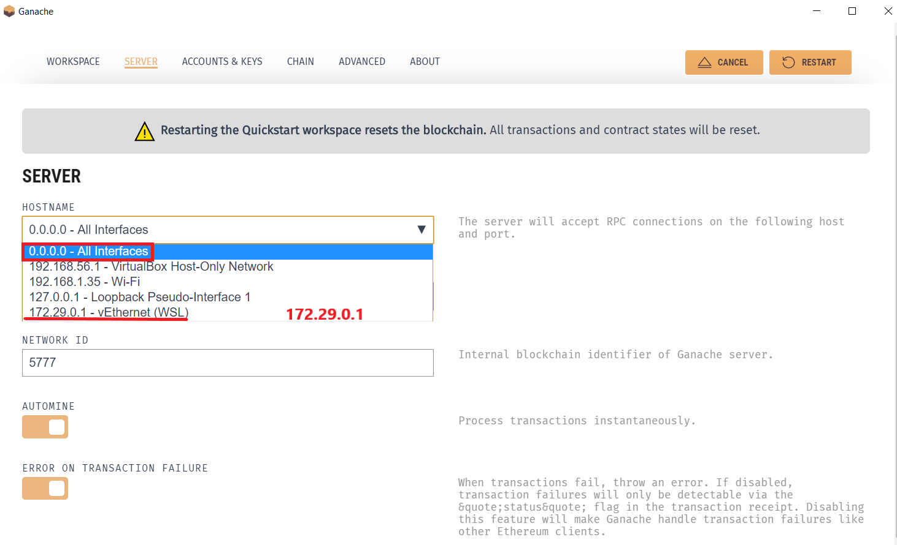

# Chronological Updates

This file will contain all updates to sections. 

# Lesson 5
## Windows, WSL, & Ganache
- Per [this question](https://github.com/smartcontractkit/full-blockchain-solidity-course-js/discussions/34#discussioncomment-2846436), if you're using WSL, for the ganache UI you'll have to use a different endpoint. 

You have 4 options to fix this:
1. Use the WSL endpoint on the ganache UI (this sometimes doesn't work)
2. Use `ganache` from the command line
3. Use `ganache-cli` from the command line (not recommended)
4. Just use `hardhat` from the command line (you'll have to use hardhat at some point anyways!)

### Using the WSL Endpoint
On the Ganache UI, you can select a different hostname and connect to whatever IP you see. In the example below, you'd connect to `172.24.224.1`



You can also try to edit it by:

1. Inside Ganache in the top-right corner tap on the gear icon (settings).
2. Then in the server tab, change the HOSTNAME and select 0.0.0.0 - All Interfaces.
3. Now replace your RPC Server URL inside the code with this latest URL that will be something like: HTTP://0.0.0.0.7545. Recheck this from Ganache.

### Using `ganache`

```
yarn global add ganache
ganache
```

Keep this running in it's own terminal, and use the endpoint it gives you. To kill it, press `CTRL` + `C`.

[See the discussion here](https://github.com/smartcontractkit/full-blockchain-solidity-course-js/discussions/34)

### Using `ganache-cli` from the command line.
Or, optionally, you can install `ganache-cli` [as this user did](https://github.com/smartcontractkit/full-blockchain-solidity-course-js/discussions/39#discussioncomment-2854165).

```
yarn global add ganache-cli
ganache-cli
```

Keep this running in it's own terminal, and use the endpoint it gives you. To kill it, press `CTRL` + `C`.

### Using `hardhat`

[See the discussion here](https://github.com/smartcontractkit/full-blockchain-solidity-course-js/discussions/90#discussioncomment-2871657)

```
yarn add --dev hardhat
yarn hardhat
```

Then select the `Create an empty hardhat.config.js`

Then run:

```
yarn hardhat node
```

Keep this running in it's own terminal, and use the endpoint it gives you. To kill it, press `CTRL` + `C`.


--------

# Lesson 6

## New Hardhat Setup

As of `2.10.0` version of hardhat, when you first run `yarn hardhat` you'll get something like this instead:

```bash
888    888                      888 888               888
888    888                      888 888               888
888    888                      888 888               888
8888888888  8888b.  888d888 .d88888 88888b.   8888b.  888888
888    888     "88b 888P"  d88" 888 888 "88b     "88b 888
888    888 .d888888 888    888  888 888  888 .d888888 888
888    888 888  888 888    Y88b 888 888  888 888  888 Y88b.
888    888 "Y888888 888     "Y88888 888  888 "Y888888  "Y888

👷 Welcome to Hardhat v2.10.0 👷‍

? What do you want to do? … 
❯ Create a JavaScript project
  Create a TypeScript project
  Create an empty hardhat.config.js
  Quit
```

It's _roughly_ similar to the options in our video, but you can just pick the `JavaScript project` whenever we don't pick the `empty hardhat.config.js`.

[You can read more about the changes here.](https://twitter.com/HardhatHQ/status/1545124474470760449)

----------

# Lesson 7

## New Hardhat Setup

As the previous section has highlighted, changes in the hardhat version changed the hardhat startup menu. You can choose to go with the new menu but if you feel lost and still want to access the old one used in the video, you can do so by installing `hardhat v2.9.3`

Run `yarn add --dev hardhat@2.9.3`

---------

# Lesson 9

## Keepers new UI

Per [this conversation](https://github.com/smartcontractkit/full-blockchain-solidity-course-js/discussions/606#discussioncomment-3037792), when you get to the new Keepers UI, select "Custom Logic"

More information: https://github.com/smartcontractkit/full-blockchain-solidity-course-js/discussions/606#discussioncomment-3037792

## Keepers Not Kicking Off Troubleshooting

If your keepers are not kicking off, run through this checklist to find out why. 

1. Double check the subscription ID in your contract
2. Double check the subscription is funded with enough LINK 
3. Is `checkUpkeep` returning true?  
4. Can you call `performUpkeep` yourself? (If you can't the keeper can't!)


-------
# Lesson 14

## Math on NFT Chance Array

The ```getBreedFromModdedRng()``` function in RandomIpfsNft.sol gets the math wrong.

line 104,
```solidity
if (moddedRng >= cumulativeSum && moddedRng < cumulativeSum + chanceArray[i]) {
    return Breed(i);
}
cumulativeSum = cumulativeSum + chanceArray[i];
```
needs to be changed to 
```solidity
if (moddedRng >= cumulativeSum && moddedRng < chanceArray[i]) {
    return Breed(i);
}
cumulativeSum = chanceArray[i];
```

The chanceArray[] array already has a cumulative probability distribution, no need to keep adding cumulativeSum to it.

According to the current algorithm:
```
moddedRng produced is between 0 and 99
chanceArray=[10,30,100]
```
```
PUG is produced if moddedRng is between [0,10)  = span of 10
SHIBA is produce if moddedRng is between [10,40) = span of 30
BERNARD is produced if moddedRng is between [40,140] = span of 60 (since moddedRng<100)
```
So the actual probabilities according to the current algo is
``` [10%,30%,60%] ```
and not
``` [10%,20%,70%]```
 as would be expected from a proper cumulative probability distribution function.
 
-------

# Lesson 15

## Metamask Troubleshooting while using Gitpod

- Remember if you are using gitpod then you cannot connect your local hardhat node with metamask. To resolve this you can use vs code or testnets instead of local node.


--------


